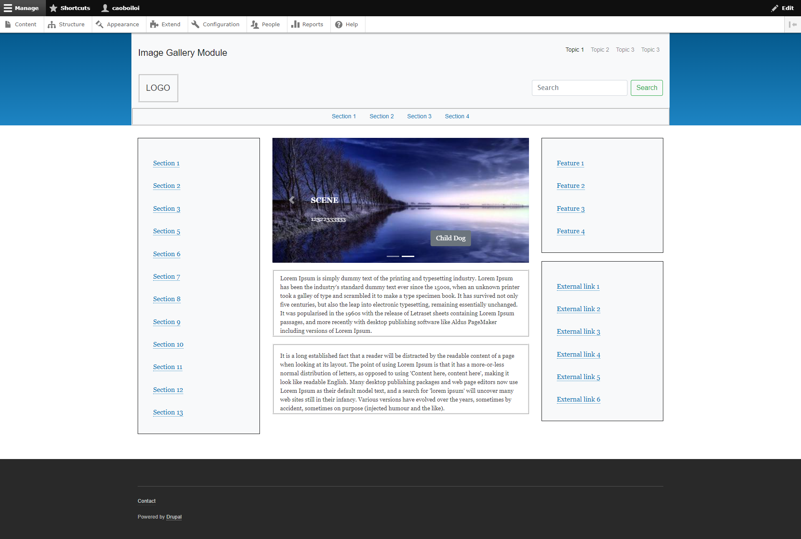

# Image-Gallery-Module-For-Drupal
The Image Gallery module that give you the ability:

* Adding a title, a paragraphs of text (description) that will be in the specified position of the banner, it's configured in Admin page. These positions can be: central, left or right.
* Adding a banner image.
* Support Slide animation effects with Slick Carousel.
* Setting maximum images are shown on the gallery, slide order.
* Adding an action button(text can be changed) with the ability to navigate to the specified article(page).
* Having a light or dark version of the paragraph styling, support Preview mode(using the AJAX API to dynamically update displays).
* Support responsive.

